<!-- ========================================== -->
<!-- 1. ANIMATED HERO & IDENTITY BANNER        -->
<!-- ========================================== -->

 

<!-- Dynamic Typing SVG Headline -->

 

<!-- Real-time Counters & Metrics Bar -->

  
  
  

<!-- Quick Action Pills -->

  <a href="#-featured-systems"><b>Explore Systems</b></a> •
  <a href="#-technical-stack"><b>Tech Matrix</b></a> •
  <a href="#-architecture--experience"><b>Core Architecture</b></a> •
  <a href="#-git-activity--metrics"><b>Analytics</b></a> •
  <a href="#-connect"><b>Get In Touch</b></a>

---

## 🌐 Engineering Persona & Mission

> *"Building intelligent systems that connect AI, software engineering, and real-world applications."*

I am a **3rd Year Artificial Intelligence & Data Science student** operating at the intersection of **Applied AI Engineering** and **Full Stack Systems Architecture**. 

Rather than treating machine learning models as isolated notebooks, I engineer complete production lifecycles: from dataset curation and multimodal inference (speech, vision, audio) to high-throughput backends (FastAPI/Node.js), hardware edge bridges (ESP32/IoT), and reactive user interfaces (React/Flutter).

With an **entrepreneurial builder mindset**, I focus on high-impact solutions for accessibility, public safety, consumer automation, and developer platforms.

---

## ⚡ Current Focus

<table>
  <tr>
    <td width="50%" valign="top">
      <h4>🔭 Active Engineering</h4>
      <ul>
        <li><b>Multimodal Communication Pipelines:</b> Advancing <b>SignAura</b> (Whisper → NLP syntactic parser → Sign Gloss → 3D skeletal motion data).</li>
        <li><b>Edge Vision &amp; Hardware Telemetry:</b> Expanding <b>Alina Smart Fridge</b> with real-time OCR expiry tracking and ESP32 streaming.</li>
        <li><b>Safety-Critical AI:</b> Architecting <b>SafePilot AI</b> driver state monitoring &amp; predictive accident prevention models.</li>
      </ul>
    </td>
    <td width="50%" valign="top">
      <h4>🧠 Current Research &amp; Deep Dives</h4>
      <ul>
        <li><b>Autonomous AI Agents:</b> Multi-agent tool-calling workflows, state graphs, and persistent execution contexts.</li>
        <li><b>Context-Window Optimization:</b> Token budgeting, multi-turn memory buffers, and hybrid vector/lexical retrieval.</li>
        <li><b>Edge AI Inference:</b> Quantized neural networks (INT8/FP16) on microcontrollers and embedded accelerators.</li>
      </ul>
    </td>
  </tr>
</table>

---

  

 

### 🖥️ Languages

  
  
  
  
  

### 🧠 AI, Machine Learning & Computer Vision

  
  
  
  
  

### ⚙️ Frameworks & Backend Engines

  
  
  
  
  

### 📚 Compute & Scientific Libraries

  
  
  
  

### 🗄️ Databases & Cloud Architecture

  
  
  
  

### 🛠️ Developer Tooling & Infrastructure

  
  
  
  
  
  

---

  

 

### 🛡️ SafePilot AI • Driver Monitoring & Predictive Safety System
> **An intelligent in-cabin telemetry and computer vision safety system designed to eliminate vehicular accidents before they occur.**

<table>
  <tr>
    <td width="65%" valign="top">
      <ul>
        <li><b>Real-Time Biometric Vision:</b> Tracks eye aspect ratio (EAR), gaze drift, head pose, and micro-sleep intervals to detect acute drowsiness.</li>
        <li><b>Medical Emergency Recognition:</b> Identifies sudden incapacitation or loss of consciousness with instant fail-safe triggers.</li>
        <li><b>Accident-Risk Prediction:</b> Dynamic multi-variable risk scoring combining driver alertness, speed vectors, and obstacle proximity.</li>
        <li><b>Automated Interventions:</b> Signals automatic braking routines, intelligent speed governing, and automated geo-tagged emergency dispatch.</li>
      </ul>
      

        
        
        
        
        
      

    </td>
    <td width="35%" valign="middle" align="center">
       
      
        
      
    </td>
  </tr>
</table>

---

### 🤟 SignAura • Multimodal AI Sign Language Communication
> **End-to-end accessible communication bridge translating spoken speech and audio directly into animated 3D sign gloss gestures.**

<table>
  <tr>
    <td width="65%" valign="top">
      
<b>Pipeline Architecture:</b>

      <code>Audio / Speech ➔ Whisper STT ➔ NLP Syntactic Parser ➔ Sign Gloss Mapper ➔ Skeletal Motion Coordinates ➔ 3D Avatar</code>
        
      <ul>
        <li><b>Acoustic Processing:</b> Uses OpenAI Whisper for noise-resilient multilingual speech-to-text tokenization.</li>
        <li><b>Grammatical Normalization:</b> Converts spoken language syntax into formal sign language gloss representation via NLP.</li>
        <li><b>Kinematic Generation:</b> Maps gloss semantics onto 3D keyframe motion vectors driving an interactive real-time avatar.</li>
      </ul>
      

        
        
        
        
        
      

    </td>
    <td width="35%" valign="middle" align="center">
       
      
        
      
    </td>
  </tr>
</table>

---

### 🧊 Alina Smart Fridge • AI + IoT Intelligent Refrigerator Assistant
> **Hardware-software edge intelligence system automating food inventory, tracking spoilage, and recommending recipes.**

<table>
  <tr>
    <td width="65%" valign="top">
      <ul>
        <li><b>Vision-Based Item Detection:</b> Embedded camera captures contents; deep learning models classify fresh items and packaged goods.</li>
        <li><b>Optical Character Recognition (OCR):</b> Extracts expiration timestamps from varied typography on product labels.</li>
        <li><b>Voice-Activated Natural Interaction:</b> Conversational voice assistant providing spoken inventory lookups and dietary warnings.</li>
        <li><b>Smart Logistics &amp; Gamification:</b> Recipe generation based solely on expiring items, reducing domestic food waste with user score rewards.</li>
        <li><b>ESP32 Microcontroller Integration:</b> Low-power sensor network measuring humidity, temperature, and door duty cycles.</li>
      </ul>
      

        
        
        
        
        
      

    </td>
    <td width="35%" valign="middle" align="center">
       
      
        
      
    </td>
  </tr>
</table>

---

### 💼 HireVia • Full Stack MERN Career & Application Engine
> **A modern, scalable recruitment platform connecting technical talent with hiring organizations.**

<table>
  <tr>
    <td width="65%" valign="top">
      <ul>
        <li><b>Robust Application Workflows:</b> End-to-end recruitment pipeline with role-based access control (Candidates &amp; Recruiters).</li>
        <li><b>Dynamic Listing Architecture:</b> Complex search filtering, salary filters, tag indexing, and resume submission pipelines.</li>
        <li><b>Scalable Backend:</b> RESTful architecture built with Node.js, Express, and MongoDB aggregation pipelines for optimal query speeds.</li>
      </ul>
      

        
        
        
        
      

    </td>
    <td width="35%" valign="middle" align="center">
       
      
        
      
    </td>
  </tr>
</table>

---

### 🧭 Learning Navigator • Guided Educational Roadmap App
> **Cross-platform mobile application delivering structured, module-based roadmaps for Web Development, AI, and Data Science.**

<table>
  <tr>
    <td width="65%" valign="top">
      <ul>
        <li><b>Curated Skill Journeys:</b> Interactive milestone tracking, resource aggregation, and self-paced progress logging.</li>
        <li><b>Real-Time Synchronization:</b> Firebase authentication, cloud Firestore data models, and offline-first mobile caching.</li>
      </ul>
      

        
        
        
        
      

    </td>
    <td width="35%" valign="middle" align="center">
       
      
        
      
    </td>
  </tr>
</table>

---

### 💬 Multi-Turn AI Chatbot • Context-Aware Conversational Engine
> **LLM dialogue system implementing stateful sliding-window context management and persistent session memory.**

<table>
  <tr>
    <td width="65%" valign="top">
      <ul>
        <li><b>Context Window Management:</b> Adaptive token pruning and summarization to maintain long-range coherence without exceeding context limits.</li>
        <li><b>Memory Layer:</b> Structured turn tracking preserving user preferences and entity references across extended interactions.</li>
      </ul>
      

        
        
        
      

    </td>
    <td width="35%" valign="middle" align="center">
       
      
        
      
    </td>
  </tr>
</table>

---

## 📊 GitHub Analytics & Engineering Velocity

  <table border="0">
    <tr>
      <td width="50%" align="center">
        
      </td>
      <td width="50%" align="center">
        
      </td>
    </tr>
    <tr>
      <td colspan="2" align="center">
        
      </td>
    </tr>
  </table>

---

## 🏆 Certifications, Hackathons & Milestones

- 🎓 **Undergraduate Scholar:** B.Tech in Artificial Intelligence &amp; Data Science (3rd Year).
- 🏆 **Hackathon Builder:** Developer behind multimodal accessibility systems (*SignAura*) and IoT safety systems (*SafePilot AI*, *Alina*).
- 📜 **Core Specializations:** Applied Machine Learning, Deep Learning Architectures, RESTful Microservices, Real-Time Edge Processing.

---

## 📬 Connect & Collaborate

I am actively seeking **AI Engineering internships, Full Stack Developer roles, and high-impact Hackathon collaborations**. Whether you want to discuss multimodal model pipelines, intelligent web platforms, or startup ventures, let's connect!

  
  &nbsp;
  
  &nbsp;
  
  &nbsp;
  

 

  Engineered with precision • Designed for recruiters &amp; collaborators • Built by <b>Sanjusri</b>

